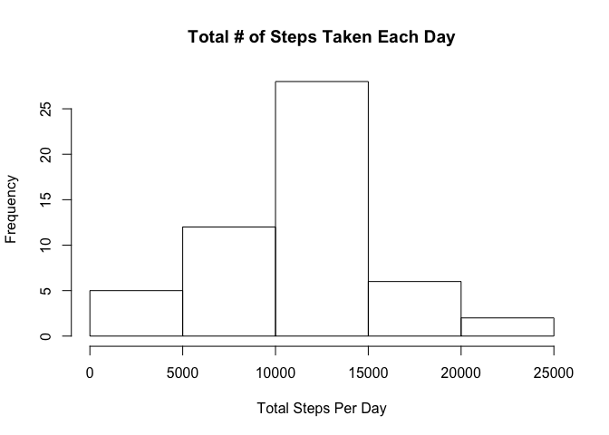
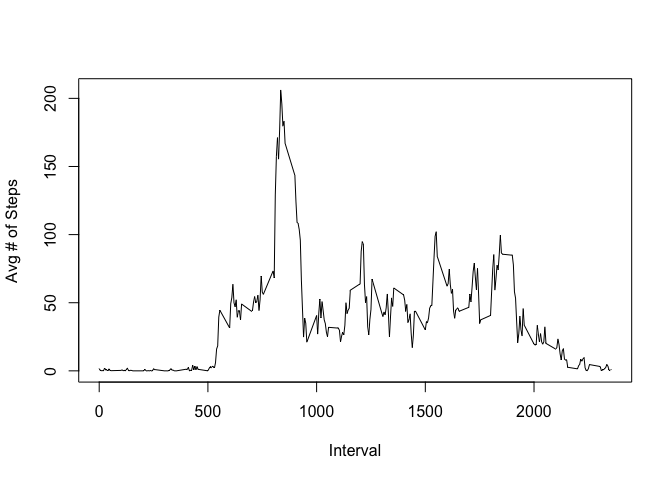
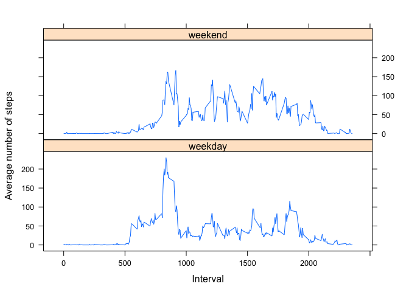

## Loading and preprocessing the data

```r
library(lattice);
library(dplyr);

# Read file
activity <- read.csv("../activity.csv")
activity$date <- as.Date(as.character(activity$date), "%Y-%m-%d")
```


## What is mean total number of steps taken per day?

```r
# Calculate the total number of steps taken per day
totalStepsByDay <- activity %>% group_by(date) %>% summarise(steps = sum(steps))

 # Make a histogram of the total number of steps taken each day
hist(totalStepsByDay$steps, xlab = "Total Steps Per Day", main="Total # of Steps Taken Each Day")
```

<!-- -->

```r
dev.off();
```

```
## null device 
##           1
```

```r
# Calculate and report the mean and median of the total number of steps taken per day
stepsMean <- mean(totalStepsByDay$steps, na.rm = T)
stepsMedian <- median(totalStepsByDay$steps, na.rm = T)
```

- Mean total steps per day: _1.0766189\times 10^{4}_
- Median total steps per day: _10765_

## What is the average daily activity pattern?

```r
# Make a time series plot (i.e. type = "l") of the 5-minute interval (x-axis) and the average number of steps taken, averaged across all days (y-axis)

# Compute average steps per interval
stepsByIntervalAveragedByDay <- aggregate(activity$steps, by=list(activity$interval), FUN=mean, na.rm=TRUE)
names(stepsByIntervalAveragedByDay) <- c("interval", "average.steps")

# Plot
with(stepsByIntervalAveragedByDay, plot(interval,average.steps,type="l", ylab="Avg # of Steps", xlab="Interval"))
```

<!-- -->

```r
dev.off();
```

```
## null device 
##           1
```

```r
# Which 5-minute interval, on average across all the days in the dataset, contains the maximum number of steps?
maxInterval <- stepsByIntervalAveragedByDay[max(stepsByIntervalAveragedByDay$average.steps),]
```

- The interval with the maximum number of steps is: _1705_ with _56.3018868_ steps.

## Imputing missing values

```r
# Calculate and report the total number of missing values in the dataset (i.e. the total number of rows with NAs)
naIdx <- which(is.na(activity$steps))
numberMissingValues <- length(naIdx)
```

- _2304_ values are missing.


```r
# Devise a strategy for filling in all of the missing values in the dataset.
# Approach taken: Replacing NA with mean.

# Create a new dataset that is equal to the original dataset but with the missing data filled in.
naInterval <- activity[naIdx, 3]
activityImputed <- activity
imputeValues <- sapply(naInterval, function(x) { stepsByIntervalAveragedByDay[(stepsByIntervalAveragedByDay$interval==x), 2]})
activityImputed[naIdx, "steps"] <- imputeValues

# Make a histogram of the total number of steps taken each day
totalStepsByDayImputed <- activityImputed %>% group_by(date) %>% summarise(steps = sum(steps))
hist(totalStepsByDay$steps, xlab = "Total Steps Per Day", main="Total # of Steps Taken Each Day")
```

<!-- -->

```r
dev.off()
```

```
## null device 
##           1
```

```r
# Calculate and report the mean and median total number of steps taken per day.
stepsMeanImputed <- mean(totalStepsByDayImputed$steps)
stepsMedianImputed <- median(totalStepsByDayImputed$steps)
```

- Mean total steps per day: _1.0766189\times 10^{4}_
- Median total steps per day: _1.0766189\times 10^{4}_
- Do these values differ from the estimates from the first part of the assignment? What is the impact of imputing missing data on the estimates of the total daily number of steps? => The mean total number of steps remains the same (_1.0766189\times 10^{4}_ and _1.0766189\times 10^{4}_), the median changed to the same value like the mean with the imputed missing values (from _10765_ to  _1.0766189\times 10^{4}_)


## Are there differences in activity patterns between weekdays and weekends?

```r
# Create a new factor variable in the dataset with two levels – “weekday” and “weekend”
activityImputed["weekday"] = factor(sapply(activityImputed$date, function(x) {
    if (weekdays(x) == "Sunday" | weekdays(x) == "Saturday") {
        "weekend"
    } else {
        "weekday"
    }
}))

# Make a panel plot containing a time series plot (i.e. type = "l") of the 5-minute interval (x-axis) and the average number of steps taken, averaged across all weekday days or weekend days (y-axis)
stepsAveragedByWeekdayAndInterval <- aggregate(steps ~ interval + weekday, mean, data = activityImputed)
xyplot(steps ~ interval | weekday, data = stepsAveragedByWeekdayAndInterval, type = "l", layout = c(1, 2), xlab = "Interval", ylab = "Average number of steps")
```

<!-- -->
